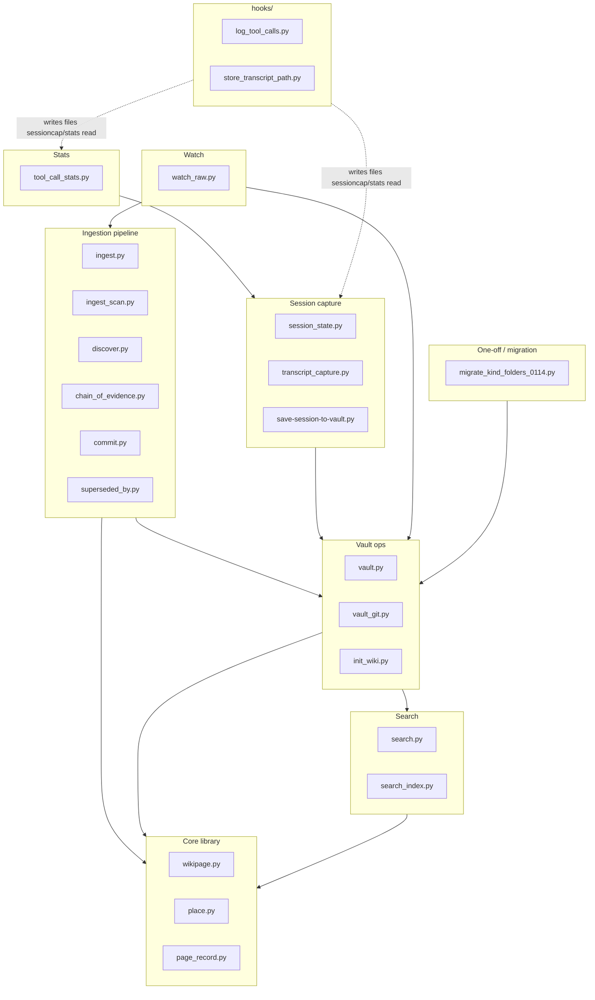
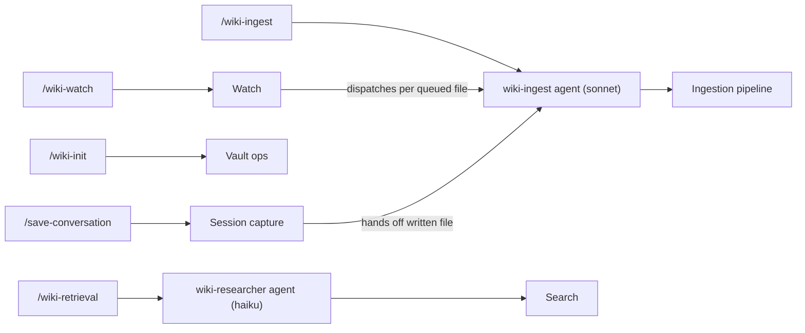
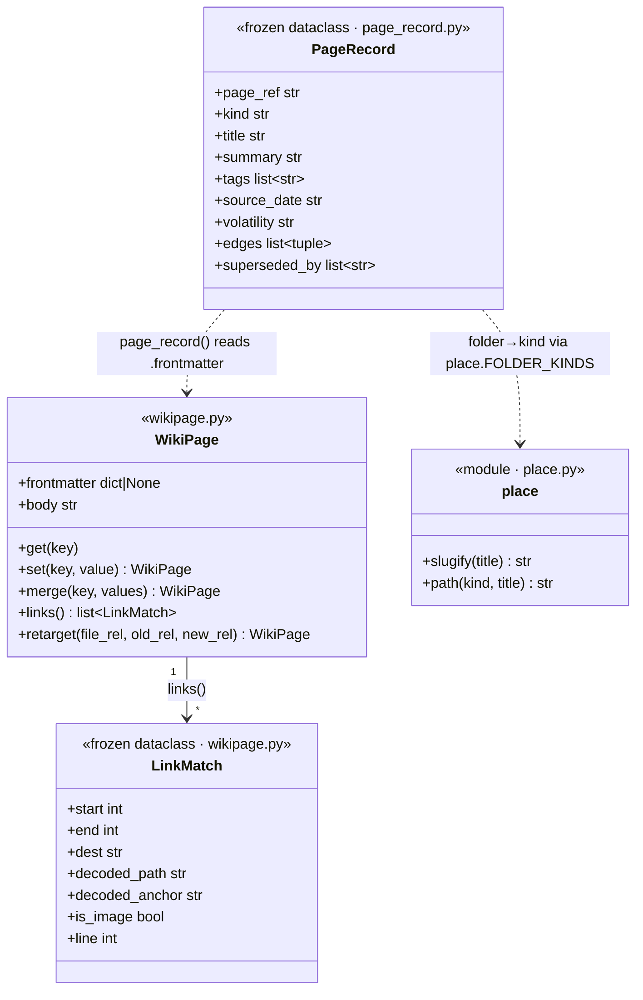
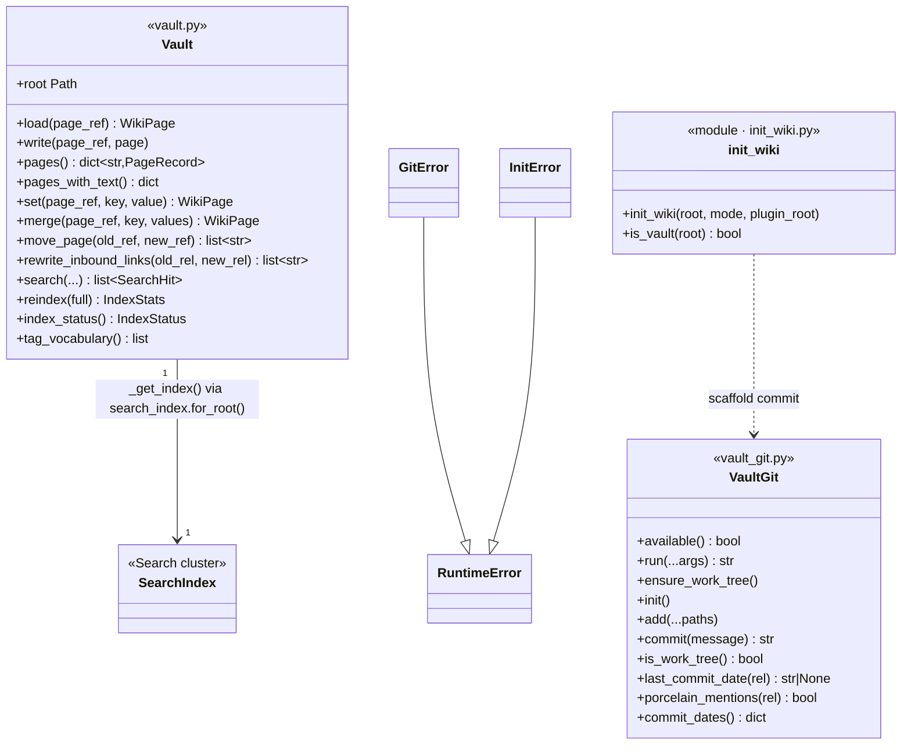
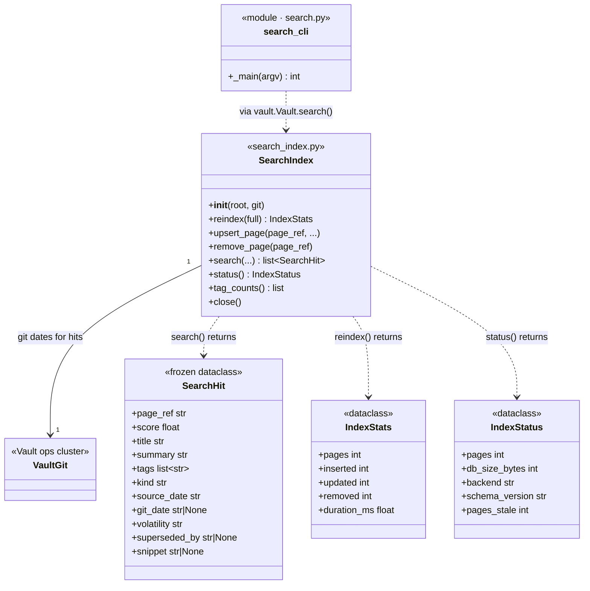
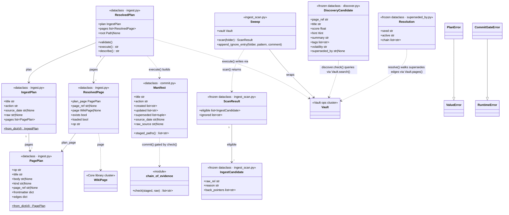
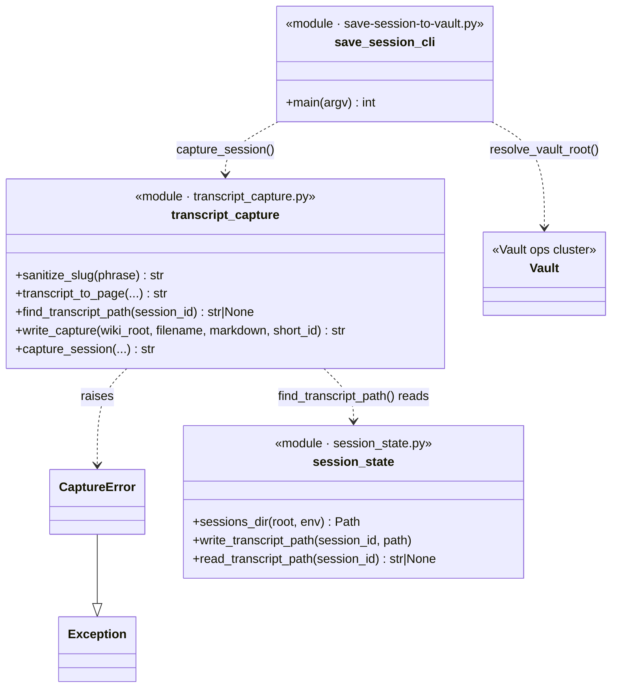
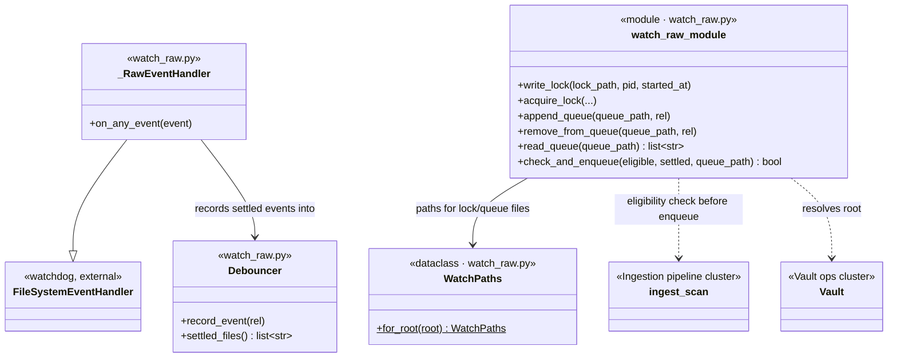
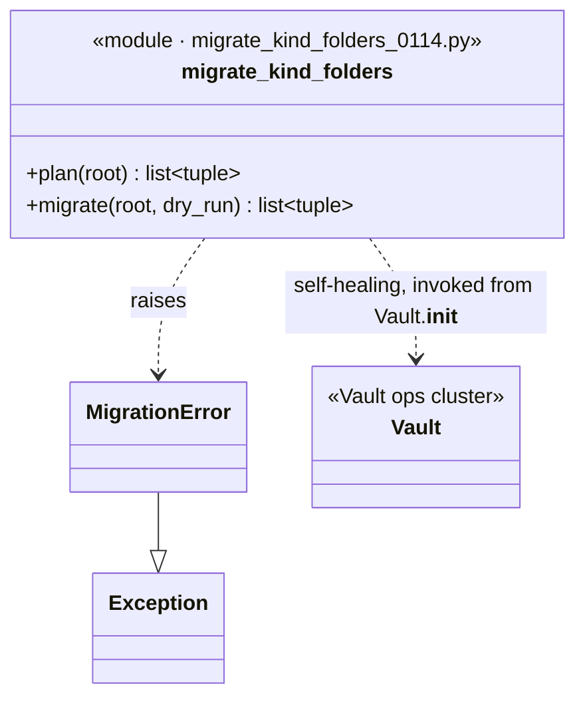
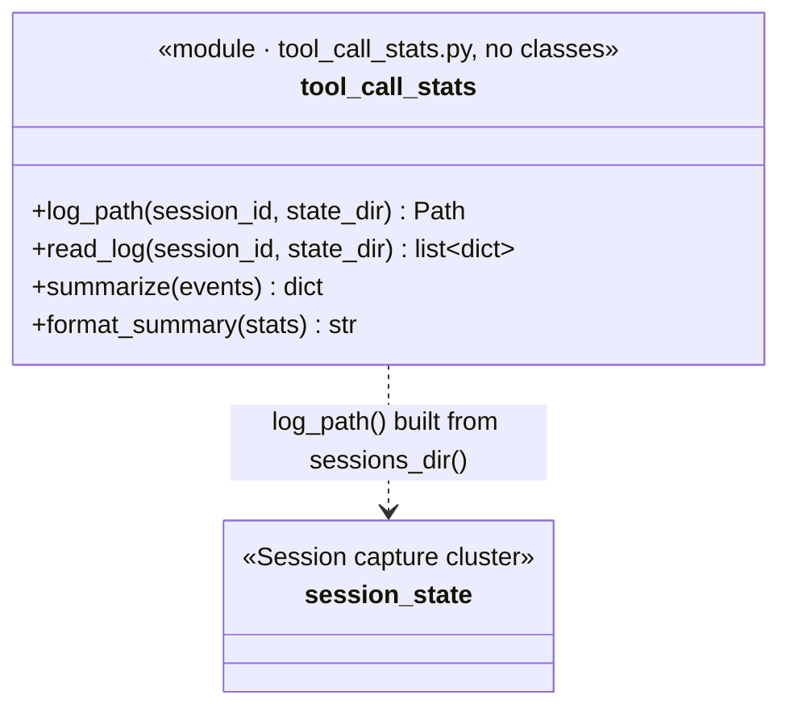

# Architecture

Point-in-time snapshot of the `wiki-knowledge` plugin's Python codebase, agents, and skills, as of plugin version `0.7.1`. This is not maintained on every change — treat it as a map from roughly now, not a live contract. If it disagrees with the code, the code wins.

**The Python script layer is being replaced by a Go binary**, one subcommand at a time ([ADR-0011](adr/0011-go-rewrite-scope-sequencing-toolchain.md)). `search` and `init` have migrated: what these diagrams show as the Search cluster and `init_wiki.py` now runs as `enchiridion search` / `enchiridion init` out of `enchiridion-go/`, invoked through `wiki-plugin/bin/enchiridion`. The shapes are unchanged — the Go packages keep the Python modules' seams — but the diagrams below are not redrawn per migrated subcommand. `wiki-plugin/skills/wiki-conventions/SKILL.md`'s script catalogue is the live answer to which capability runs on which implementation.

Diagrams:

1. **Module dependency graph** — how `wiki-plugin/scripts/*.py` (and `hooks/`) depend on each other, clustered by responsibility.
2. **Skill → agent → script-cluster flow** — how each of the plugin's five slash-command entrypoints reaches the code in diagram 1.
3. **Class diagrams by cluster** — one diagram per cluster from (1), showing its actual classes/dataclasses, fields, methods, and relationships.

## Module dependency graph

Scripts are grouped into eight responsibility clusters, plus a `hooks/` cluster shown separately. An arrow between clusters means at least one module in the source cluster imports at least one module in the target cluster; individual file-level imports are collapsed for readability (see each cluster's file list for exact contents).

Cluster contents:

- **Core library** — `wikipage.py` (`WikiPage` get/set/merge/retarget, `plan_move`; no I/O), `place.py` (kebab-slug + kind-folder path computation), `page_record.py` (frontmatter schema reader, derives `kind` and `superseded_by`).
- **Vault ops** — `vault.py` (`Vault`: all I/O, `resolve_vault_root()`), `vault_git.py` (sole git-shell-out module), `init_wiki.py` (vault scaffolding for `/wiki-init`).
- **Search** — `search.py` (query CLI), `search_index.py` (SQLite FTS5 index, `for_root()` cache).
- **Ingestion pipeline** — `ingest.py` (`IngestPlan` executor), `ingest_scan.py` (`raw/` sweep eligibility), `discover.py` (overlap-candidate + tag-vocabulary lookup), `chain_of_evidence.py` (page→stub→raw-file rule), `commit.py` (structured git commit per manifest), `superseded_by.py` (supersession queries).
- **Session capture** — `session_state.py` (session→transcript-path lookup), `transcript_capture.py` (JSONL→page rendering), `save-session-to-vault.py` (CLI adapter for `/save-conversation`).
- **Watch** — `watch_raw.py` (event-driven `raw/` watcher: debounce, lock file, queue file).
- **One-off / migration** — `migrate_kind_folders_0114.py` (singular→plural kind-folder migration, self-healing via `Vault.__init__`).
- **Stats** — `tool_call_stats.py` (summarizes a session's hook-logged tool calls).
- **hooks/** — `log_tool_calls.py`, `store_transcript_path.py`. These aren't imported by anything; they run as Claude Code hook events and write JSON files that Session capture and Stats later read. The dashed edges mark that producer→consumer relationship, not a Python import.

## Skill → agent → script-cluster flow

Each of the plugin's five skills, traced through its agent (if any) to the script cluster(s) it drives. `/wiki-watch` and `/save-conversation` are dispatchers: both hand off into the `/wiki-ingest` flow rather than duplicating it.

Notes:

- `/wiki-init` calls `enchiridion init` (ported from `init_wiki.py`) directly — no agent involved, it's pure scaffolding.
- `/wiki-watch` runs `watch_raw.py` and `ingest_scan.py` (Watch cluster) itself, then dispatches one `wiki-ingest` subagent per eligible/queued file — the same agent `/wiki-ingest` uses, not a separate copy.
- `/save-conversation` runs `save-session-to-vault.py` (Session capture cluster) to write the raw transcript file, then delegates to the `wiki-ingest` agent to file it into the vault — again reusing the same agent and pipeline, not a parallel one.
- Script clusters here are the same eight named in the module dependency graph above.

## Class diagrams by cluster

One diagram per cluster from the module dependency graph, showing its actual classes/dataclasses and their relationships. Several clusters (session capture, migration, stats) are mostly free functions rather than classes — those modules are shown as `<<module>>` boxes listing their public functions, for the same collapsed-but-accurate treatment as the classed modules. Cross-cluster references are dashed and named after the target cluster.

### Core library

### Vault ops

### Search

### Ingestion pipeline

### Session capture

### Watch

### One-off / migration

### Stats

