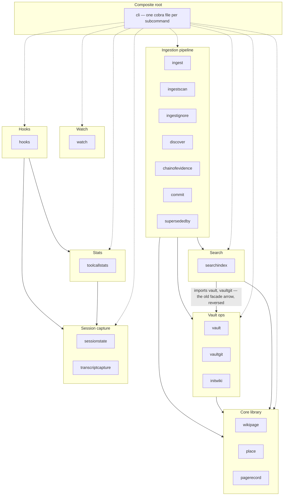
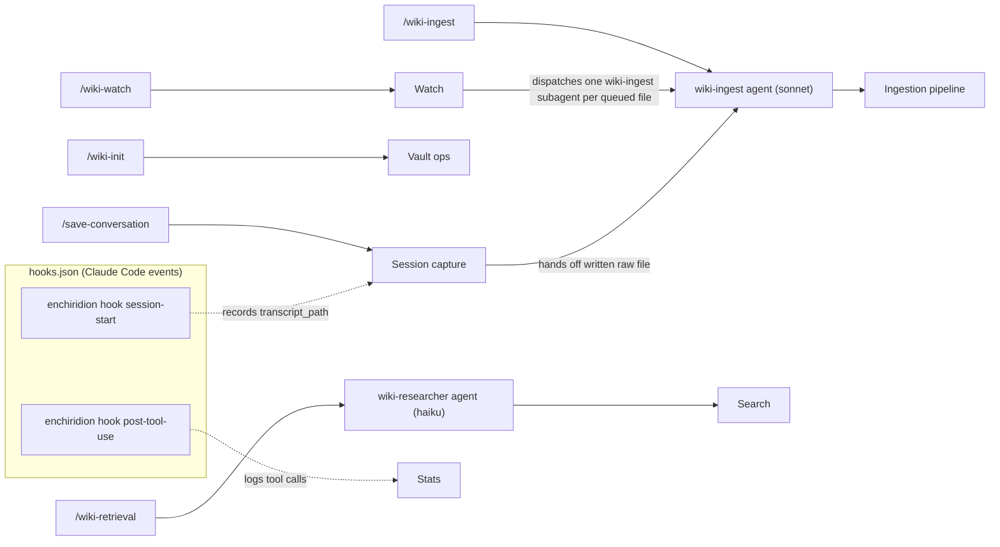
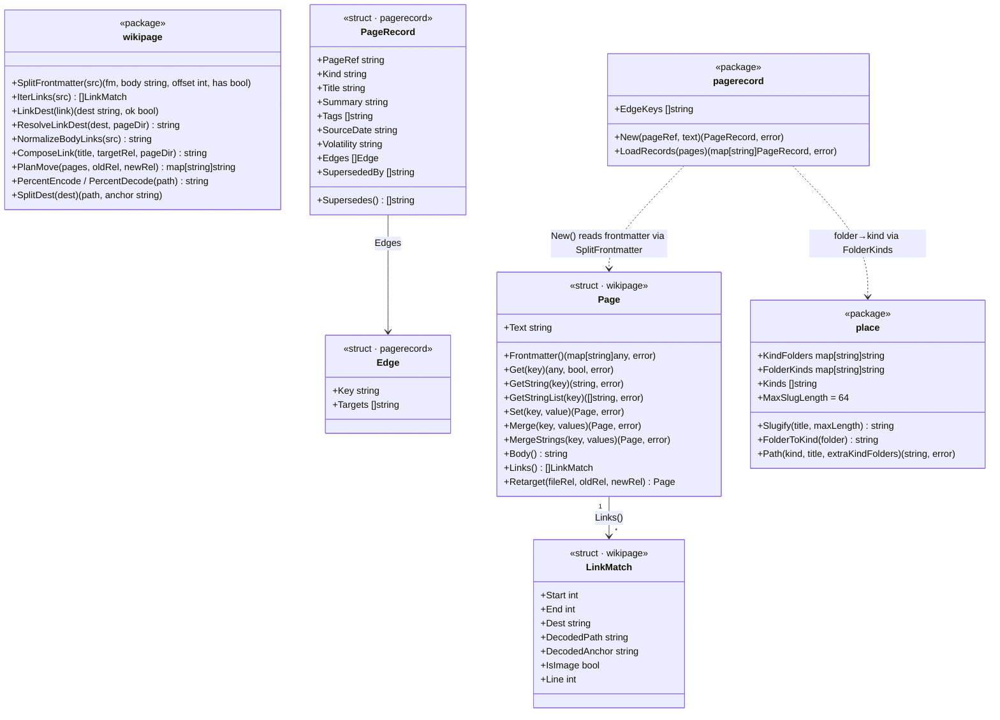
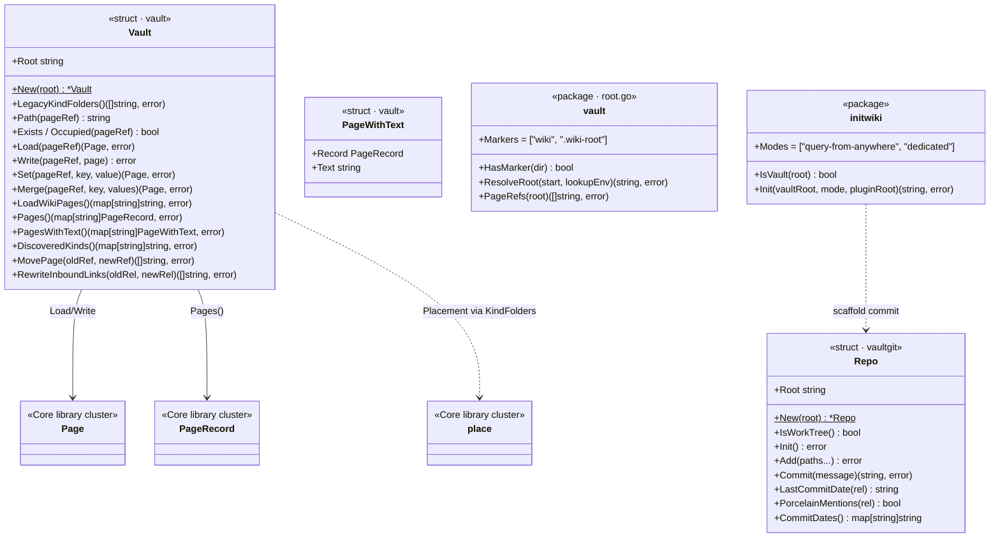
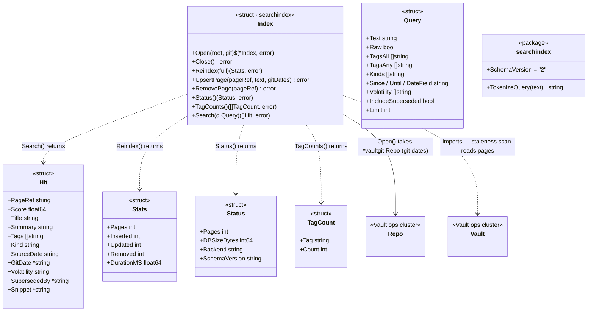
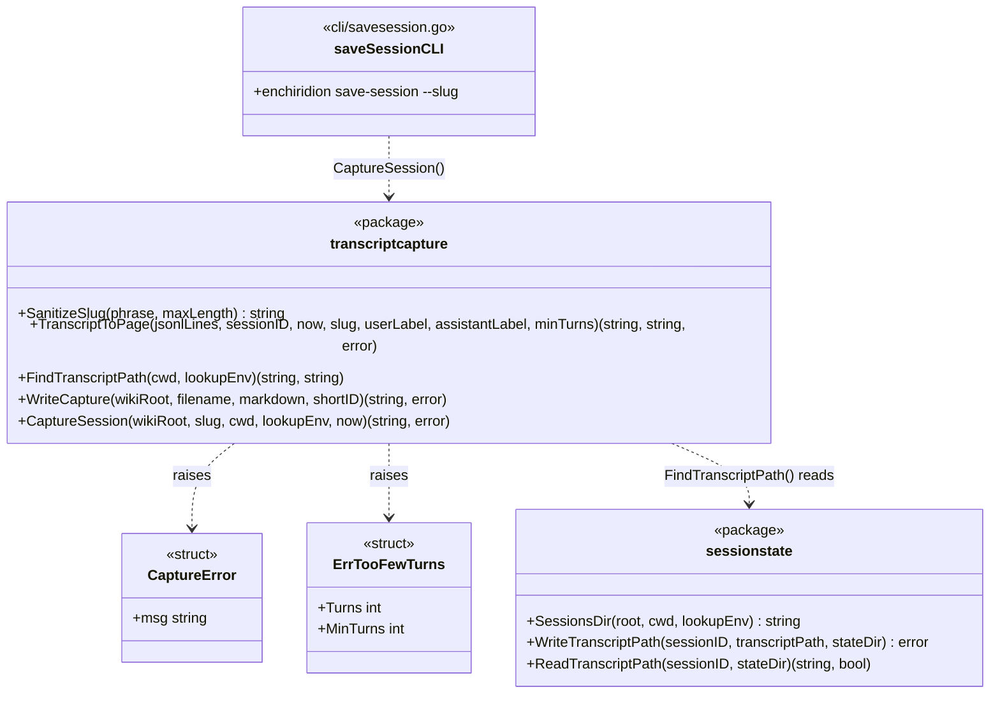
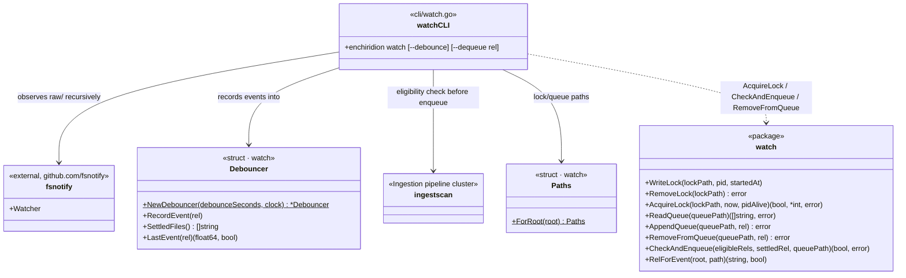
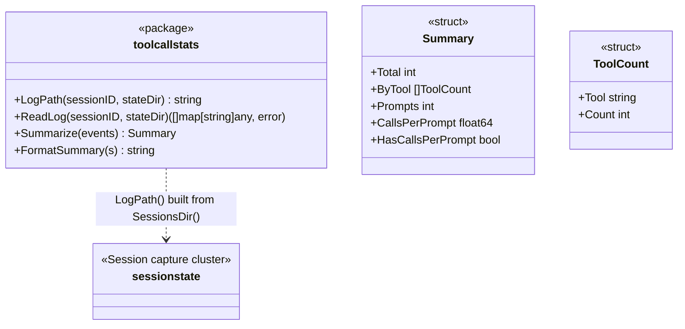

# Architecture

Point-in-time snapshot of the `wiki-knowledge` plugin's script layer, agents, and skills, as of plugin version `0.7.6`. This is not maintained on every change — treat it as a map from roughly now, not a live contract. If it disagrees with the code, the code wins.

The script layer is a single static Go binary at `enchiridion-go/` (`enchiridion`, one subcommand per capability), invoked through `wiki-plugin/bin/enchiridion` — a POSIX-sh entrypoint that lazy-fetches the release binary ([ADR-0013](adr/0013-go-binary-lazy-fetch-dependency-free-bootstrap.md)). The names in these diagrams are Go packages under `enchiridion-go/internal/`; the diagram from before the Go rewrite ([ADR-0011](adr/0011-go-rewrite-scope-sequencing-toolchain.md)) is gone because it named deleted Python modules. This redraw keeps the responsibility clusters the Python version used, re-expressed for packages ([#191](https://github.com/dhague/enchiridion/issues/191)).

Diagrams:

1. **Package dependency graph** — how `enchiridion-go/internal/*` depends on each other, clustered by responsibility.
2. **Skill → agent → cluster flow** — how each of the plugin's five slash-command entrypoints reaches the code in diagram 1.
3. **Struct/interface diagrams by cluster** — one diagram per cluster from (1), showing its actual structs, interfaces, and package functions.

Two seams worth keeping straight, since both are *different* from the Python era and the diagrams show them:

- **Go's `Vault` has no search-index facade.** `searchindex` imports `vault`, so proxying back would be an import cycle; the arrow that used to run `vault → search_index` is reversed to `search → vaultops`, and there are no facade methods on `Vault`. Callers that need to search open a `searchindex.Index` directly, as `enchiridion search` does.
- **There is no `ForRoot` per-root cache.** `Open`/`Close` make the connection lifetime explicit, and everything below the cobra command takes a `discover.Searcher` rather than a vault root ([ADR-0010](adr/0010-search-index-per-root-cache.md)'s *Go port* section).

## Package dependency graph

Packages are grouped into the same responsibility clusters as the retired scripts, plus a composite root. An arrow between clusters means at least one package in the source cluster imports at least one package in the target cluster; individual package-level imports are collapsed for readability (see each cluster's file list for exact contents). The dashed arrows from the composite root are the `cli` package importing every cluster — it is the composition root, one cobra file per subcommand, and the wiring that used to live in a `__main__` per script now passes through it.

Cluster contents:

- **Core library** — `wikipage` (the pure page model: `Page` get/set/merge/retarget, link machinery — `IterLinks`, `PercentEncode`/`PercentDecode`, `PlanMove`; no I/O), `place` (kebab-slug + kind-folder path computation; `KindFolders` is the single source of truth), `pagerecord` (frontmatter schema reader; derives `kind` from folder and `superseded_by` by inverting `supersedes` edges).
- **Vault ops** — `vault` (the `Vault` I/O type — all reads/writes, cross-page `MovePage`/`RewriteInboundLinks`, and `ResolveRoot`), `vaultgit` (sole git access, embedded go-git), `initwiki` (vault scaffolding for `/wiki-init`).
- **Search** — `searchindex` (SQLite FTS5 index over `ncruces/go-sqlite3`; `Open`/`Close` lifetime, staleness scan on every search, ADR-0006/0010).
- **Ingestion pipeline** — `ingest` (the `Plan`/`Resolved` schema + `Resolve`→`Validate`→`Execute` executor), `ingestscan` (`raw/` sweep eligibility, ADR-0009 `page_ref`), `ingestignore` (`.ingestignore` parse/append), `discover` (overlap-candidate + tag-vocabulary lookup), `chainofevidence` (page→stub→raw-file rule), `commit` (structured git commit per manifest, gated by chain of evidence), `supersededby` (supersession queries).
- **Session capture** — `sessionstate` (session→transcript-path lookup under `.claude/wiki-knowledge/sessions/`), `transcriptcapture` (JSONL→page rendering + the `save-session` writer).
- **Watch** — `watch` (debounce, lock file, queue file; pure — no I/O beyond what callers hand it).
- **Stats** — `toolcallstats` (summarizes a session's hook-logged tool calls).
- **hooks** — `hooks` (`SessionStart`/`PostToolUse`, the handlers for the `hook` subcommands, #153). It isn't imported by anything but `cli`; it runs as Claude Code hook events and writes the JSON state files Session capture and Stats later read. In the Python era those were dashed producer→consumer edges; in Go the hooks package imports `sessionstate` and `toolcallstats` directly, so the edges are real imports.
- **Composite root** — `cli`, one file per subcommand (`root.go` for the root `enchiridion` command and `version`, then `search.go`, `ingest.go`, `hook.go`, `vault.go`, `page.go`, `place.go`, `savesession.go`, `watch.go`, `toolcallstats.go`, `supersededby.go`, `commit.go`, `init.go`, `ingestscan.go`, `discover.go`). It resolves the vault root, opens the single `searchindex.Index` handle, and passes it down.

## Skill → agent → cluster flow

Each of the plugin's five skills, traced through its agent (if any) to the cluster(s) it drives. `/wiki-watch` and `/save-conversation` are dispatchers: both hand off into the `/wiki-ingest` flow rather than duplicating it. The hooks row shows the automatic path — `hooks.json` wires both events to `bin/enchiridion hook <event>`, and the state they write is what Session capture and Stats read.

Notes:

- `/wiki-init` calls `enchiridion init` directly (from `initwiki`, using `vault`/`vaultgit`) — no agent involved, it's pure scaffolding.
- `/wiki-watch` runs `enchiridion watch` (Watch cluster, `cli/watch.go` — fsnotify observer + `watch` debounce/lock/queue) with `enchiridion ingest-scan` (Ingestion pipeline cluster) as the eligibility check, then dispatches one `wiki-ingest` subagent per eligible/queued file — the same agent `/wiki-ingest` uses, not a separate copy.
- `/save-conversation` runs `enchiridion save-session` (Session capture cluster, `cli/savesession.go` → `transcriptcapture.CaptureSession`) to write the raw transcript file, then delegates to the `wiki-ingest` agent to file it into the vault — again reusing the same agent and pipeline, not a parallel one.
- `enchiridion hook session-start` / `hook post-tool-use` (`cli/hook.go` → `hooks`) run as Claude Code hook events per `wiki-plugin/hooks/hooks.json`, **not** from a skill: SessionStart records the transcript path `save-session` later reads, PostToolUse appends one JSON line per tool call for `enchiridion tool-call-stats`. Both fail open (`|| exit 0`), and PostToolUse sets `ENCHIRIDION_NO_FETCH=1` so a failing binary bootstrap never re-downloads hundreds of times a session.
- Clusters here are the same ones named in the package dependency graph above.

## Struct/interface diagrams by cluster

One diagram per cluster from the package dependency graph. Go has no classes; types are shown as structs (`<<struct>>`) with their exported fields and methods, and module-level functions as `<<package>>` boxes. Interfaces are `<<interface>>`. Cross-cluster references are dashed and named after the target cluster.

### Core library

### Vault ops

No `SearchIndex` relationship here on purpose: the Python `Vault`'s search facade was not ported — `searchindex` imports `vault`, so the arrow now runs the other way and `enchiridion search` opens the index itself (see the Search diagram).

### Search

Search correctness lives in the staleness scan `Index.Search` runs before matching — an unconditional `(mtime_ns, size)` check over `Vault.PagesWithText()` — so the FTS5 table can never go stale because a caller forgot an inline update. There is no `ForRoot` per-root cache and no `Vault` facade: the cobra command opens the one `Index` via `searchindex.Open`, and passes it down as a `discover.Searcher` (ADR-0010).

### Ingestion pipeline

```mermaid
classDiagram
    class Plan {
        <<struct · ingest>>
        +Title string
        +Action string
        +SourceDate string
        +Raw string
        +Pages []PagePlan
        +DecodePlan(r)$ (Plan, error)
    }
    class PagePlan {
        <<struct · ingest>>
        +Op string
        +Title string
        +Kind string
        +PageRef string
        +Body *string
        +Frontmatter OrderedMap[any]
        +Edges OrderedMap[[]string]
    }
    class OrderedMap {
        <<struct · ingest>>
        +Keys []string
        +Values map[string]V
        +Get(key) (V, bool)
        +Len() int
        +All(yield)
    }
    class Resolved {
        <<struct · ingest>>
        +Plan Plan
        +Pages []ResolvedPage
        +Root string
        +ExtraKindFolders map[string]string
        +Resolve(plan, root)$ (*Resolved, error)
        +Validate() error
        +Execute(git) (string, error)
        +Describe() string
    }
    class ResolvedPage {
        <<struct · ingest>>
        +Plan PagePlan
        +PageRef string
        +Page *Page
        +Occupied bool
        +Loaded bool
        +Op() string
    }
    class Manifest {
        <<struct · commit>>
        +Title string
        +Action string
        +Created []string
        +Updated []string
        +Superseded []Supersession
        +SourceDate string
        +RawSource string
        +StagedPaths() []string
    }
    class Supersession {
        <<struct · commit>>
        +Old string
        +New string
    }
    class Git {
        <<interface · commit>>
        +IsWorkTree() bool
        +Add(paths...) error
        +Commit(message) (string, error)
    }
    class chainofevidence {
        <<package>>
        +Check(staged, raw) ([]string, error)
    }
    class Searcher {
        <<interface · discover>>
        +Search(q) ([]searchindex.Hit, error)
    }
    class Candidate {
        <<struct · discover>>
        +PageRef string
        +Title string
        +Score float64
        +Hint Hint
        +Summary string
        +Tags []string
        +Volatility string
        +SupersededBy *string
    }
    class PageResult {
        <<struct · discover>>
        +Title string
        +Candidates []Candidate
    }
    class Resolution {
        <<struct · supersededby>>
        +Seed string
        +Active string
        +Chain []string
        +Resolve(seeds, records)$ []Resolution
    }
    class ScanCandidate {
        <<struct · ingestscan>>
        +RawRel string
        +Reason string
        +BackPointers []string
    }
    class ScanResult {
        <<struct · ingestscan>>
        +Eligible []ScanCandidate
        +Ignored []string
    }
    class ScanGit {
        <<interface · ingestscan>>
        +LastCommitDate(rel) string
        +PorcelainMentions(rel) bool
    }
    class ingestignore {
        <<package>>
        +Filename = ".ingestignore"
        +Parse(text) ([]string, error)
        +Append(folder, pattern, comment) error
    }
    class Vault {
        <<Vault ops cluster>>
    }
    class Repo {
        <<Vault ops cluster>>
    }
    class Page {
        <<Core library cluster>>
    }
    class PageRecord {
        <<Core library cluster>>
    }
    class Index {
        <<Search cluster>>
    }

    Plan "1" --> "*" PagePlan : Pages
    Resolved --> Plan : Plan
    Resolved "1" --> "*" ResolvedPage : Pages
    ResolvedPage --> PagePlan : Plan
    ResolvedPage ..> Page : Page
    Resolved ..> Manifest : Execute() builds
    Resolved ..> Vault : Execute() writes via
    Resolved ..> Git : Execute(git) — *vaultgit.Repo satisfies
    Manifest ..> chainofevidence : Commit() gated by Check()
    Manifest --> Supersession : Superseded
    Searcher ..> Index : implemented by searchindex.Index
    Candidate --> Searcher : Check()/Discover() search via
    supersededby ..> PageRecord : Resolve() walks supersedes edges
    ScanResult "1" --> "*" ScanCandidate : Eligible
    ingestscan ..> ScanGit : Scan() takes a Git
    ScanGit ..> Repo : satisfied by vaultgit.Repo
    ingestscan ..> Vault : raw/ reads
    ingestscan ..> ingestignore : LoadIngestignore()
```

The pipeline is `Resolve → Validate → Execute → commit`; validation reads only resolved facts and execution writes only resolved pages, so the checked plan and the written plan cannot diverge. The chain-of-evidence check is run twice — pre-flight by validation (a courtesy) and again by `commit.Commit` as the hard gate — so a hand-built manifest can't route around it. `discover` is the one place this cluster reaches into Search: `Check` classifies overlap candidates against the index via a `Searcher`, which is how `cli`'s single open `Index` reaches it without a vault root.

### Session capture

`enchiridion save-session` reads the transcript path the SessionStart hook recorded (under `.claude/wiki-knowledge/sessions/`), renders the JSONL transcript to markdown, and writes `raw/conversations/<YYYY-MM-DD-hhmm>-<slug>-<short-id>.md`, printing the vault-relative path. Claude Code only for now — there is no OpenCode path yet ([#188](https://github.com/dhague/enchiridion/issues/188)).

### Watch

`watch` itself is pure — it holds no watcher and touches no filesystem it isn't handed. `cli/watch.go` is where the composition happens: an fsnotify observer feeds `Debouncer.RecordEvent`, a ticker drains `Debouncer.SettledFiles()`, and each settled file is queued only if `ingestscan.Scan` marks it eligible. In the Python era `watch_raw.py` imported `ingest_scan.py` directly; that edge now runs through the composite root.

### Stats

`enchiridion tool-call-stats` reads the JSON-lines log the PostToolUse hook appends to per session, and prints the per-tool histogram with the prompt-count proxy — tool-call count, not exact turn count, is the recoverable metric ([#99](https://github.com/dhague/enchiridion/issues/99)). `enchiridion ingest` also prints the same summary after the commit SHA, best-effort and silent when no log exists.
