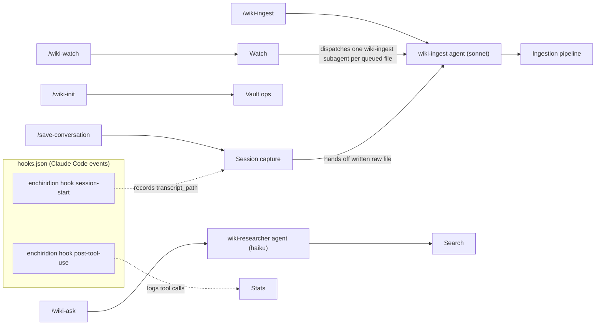
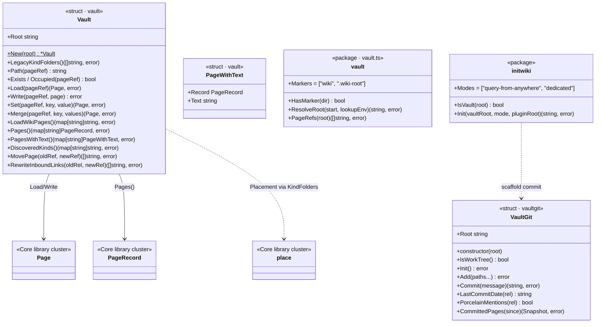
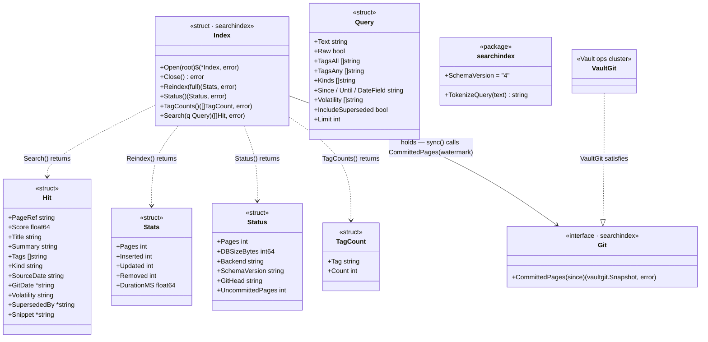
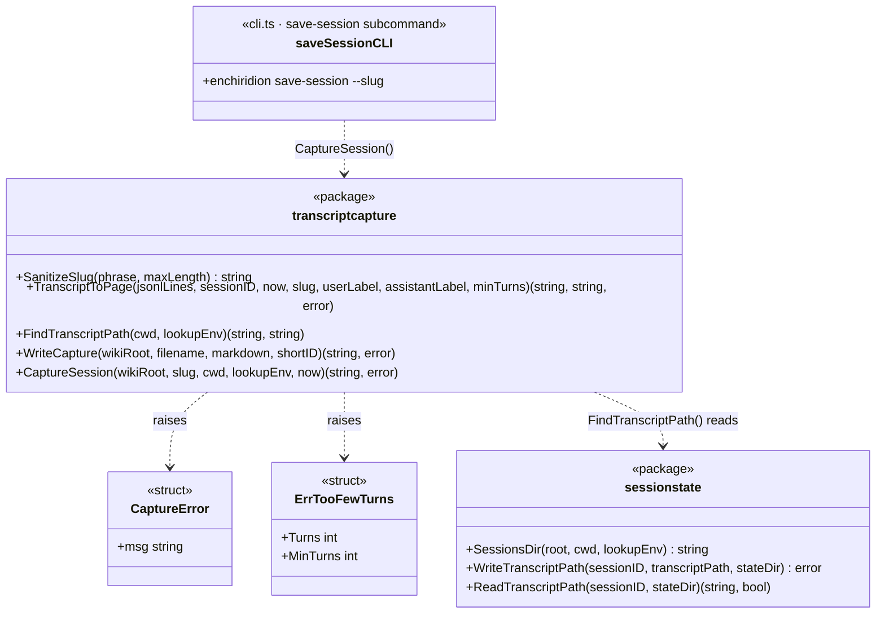
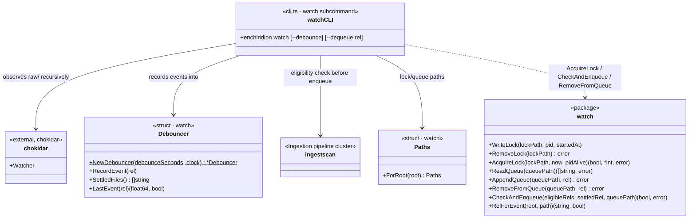
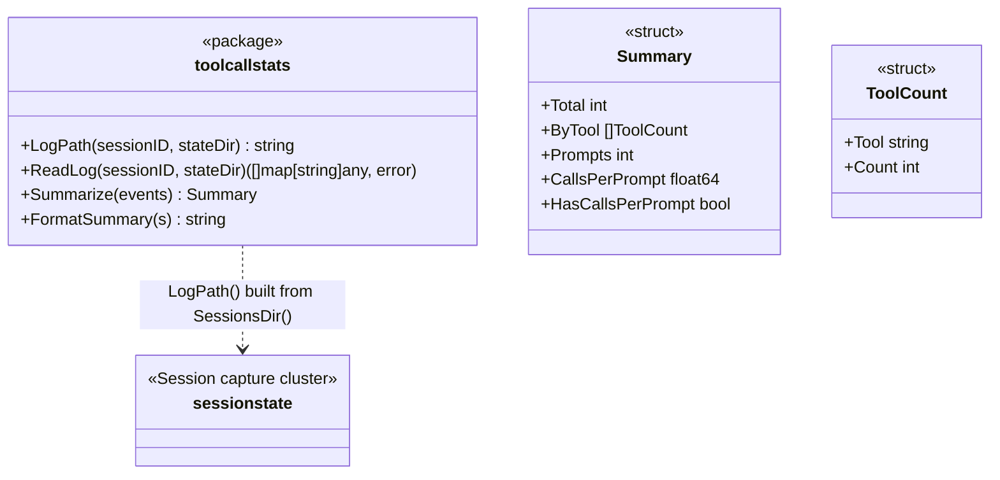

# Architecture

Point-in-time snapshot of the `wiki-knowledge` plugin's script layer, agents, and skills, as of plugin version `0.8.2`. This is not maintained on every change — treat it as a map from roughly now, not a live contract. If it disagrees with the code, the code wins.

The script layer is a single TypeScript implementation at `enchiridion-ts/` (`enchiridion`, one subcommand per capability), bundled by esbuild and invoked through `wiki-plugin/bin/enchiridion` — a POSIX-sh entrypoint that execs `node` against the bundle ([ADR-0017](adr/0017-bundled-typescript-on-installed-interpreter.md)). The names in these diagrams are TypeScript modules under `enchiridion-ts/src/`.

Diagrams:

1. **Module dependency graph** — how `enchiridion-ts/src/*` depends on each other, clustered by responsibility.
2. **Skill → agent → cluster flow** — how each of the plugin's five slash-command entrypoints reaches the code in diagram 1.
3. **Type diagrams by cluster** — one diagram per cluster from (1), sketching its types and module-level functions.

Two seams worth keeping straight, since the diagrams show them:

- **The `Vault` has no search-index facade.** `searchindex` depends only on `vaultgit` (blobs, dates) and otherwise walks the wiki tree itself, so proxying back through `vault` would be an import cycle; there are no facade methods on `Vault`. Callers that need to search open a `searchindex.Index` directly, as `enchiridion search` does. Since [ADR-0015](adr/0015-search-index-view-of-committed-history.md), `searchindex`'s centre of gravity has been `vaultgit`: page content and dates come from `VaultGit.CommittedPages` (git blobs), and `Status()`'s on-disk-vs-indexed count is computed internally by counting `wiki/**.md` files on disk.
- **There is no `ForRoot` per-root cache.** `Open`/`Close` make the connection lifetime explicit, and everything below the CLI command takes a `discover.Searcher` rather than a vault root ([ADR-0010](adr/0010-search-index-per-root-cache.md)).

**How this stays current.** The redraw keeps the diagrams hand-drawn rather than generated, and the opening warning stays honest about that. Mechanical generation was weighed and set aside: a tool could emit the raw import graph, but the value of this file is the responsibility *clustering* and the reasoning about the seams — the parts tooling cannot produce. The type diagrams are kept for the same reason: they are the cheap, nameable API contract of each module, and a reader who finds a stale method name is told to trust the code. The cost is the warning above: the next structural change to the module set should touch this file again.

## Module dependency graph

Modules are grouped into responsibility clusters. An arrow between clusters means at least one module in the source cluster imports at least one module in the target cluster; individual module-level imports are collapsed for readability (see each cluster's file list for exact contents). The dashed arrows from the composite root are `cli.ts` importing every cluster — it is the composition root, one commander file per subcommand, and the wiring of every subcommand passes through it.

```mermaid
flowchart TB
    subgraph cli_root["Composite root"]
        cli["cli.ts — one commander file per subcommand"]
    end

    subgraph core["Core library"]
        wikipage["wikipage.ts"]
        place["place.ts"]
        pagerecord["pagerecord.ts"]
    end

    subgraph vaultops["Vault ops"]
        vault["vault.ts"]
        vault_git["vaultgit.ts"]
        init_wiki["initwiki.ts"]
    end

    subgraph search["Search"]
        search_index["searchindex.ts"]
    end

    subgraph ingestion["Ingestion pipeline"]
        ingest["ingest.ts"]
        ingest_scan["ingestscan.ts"]
        ingest_ignore["ingestignore.ts"]
        discover["discover.ts"]
        chain_of_evidence["chainofevidence.ts"]
        commit["commit.ts"]
        superseded_by["supersededby.ts"]
    end

    subgraph sessioncap["Session capture"]
        session_state["sessionstate.ts"]
        transcript_capture["transcriptcapture.ts"]
    end

    subgraph watch["Watch"]
        watch_pkg["watch.ts"]
    end

    subgraph stats["Stats"]
        tool_call_stats["toolcallstats.ts"]
    end

    subgraph hooks["Hooks"]
        hooks_pkg["hooks.ts"]
    end

    ingestion --> core
    ingestion --> vaultops
    vaultops --> core
    search -->|imports vaultgit (blobs, dates) — the old facade arrow, reversed; no vault import| vaultops
    ingestion --> search
    hooks --> sessioncap
    hooks --> stats
    stats --> sessioncap

    cli -.-> core
    cli -.-> vaultops
    cli -.-> search
    cli -.-> ingestion
    cli -.-> sessioncap
    cli -.-> watch
    cli -.-> stats
    cli -.-> hooks
```

Cluster contents:

- **Core library** — `wikipage.ts` (the pure page model: `Page` get/set/merge/retarget, link machinery — `IterLinks`, `PercentEncode`/`PercentDecode`, `PlanMove`; no I/O), `place.ts` (kebab-slug + kind-folder path computation; `KindFolders` is the single source of truth), `pagerecord.ts` (frontmatter schema reader; derives `kind` from folder and `superseded_by` by inverting `supersedes` edges).
- **Vault ops** — `vault.ts` (the `Vault` I/O type — all reads/writes, cross-page `MovePage`/`RewriteInboundLinks`, and `ResolveRoot`), `vaultgit.ts` (sole git access, isomorphic-git), `initwiki.ts` (vault scaffolding for `/wiki-init`).
- **Search** — `searchindex.ts` (SQLite FTS5 index over `node-sqlite3-wasm`; `Open`/`Close` lifetime, ADR-0006/0010/0015 — a materialised view of `HEAD`'s committed `wiki/` tree, watermarked in `meta.git_head`, not a working-tree scan).
- **Ingestion pipeline** — `ingest.ts` (the `Plan`/`Resolved` schema + `Resolve`→`Validate`→`Execute` executor), `ingestscan.ts` (`raw/` sweep eligibility, ADR-0009 `page_ref`), `ingestignore.ts` (`.ingestignore` parse/append), `discover.ts` (overlap-candidate + tag-vocabulary lookup), `chainofevidence.ts` (page→stub→raw-file rule), `commit.ts` (structured git commit per manifest, gated by chain of evidence), `supersededby.ts` (supersession queries).
- **Session capture** — `sessionstate.ts` (session→transcript-path lookup under `.claude/wiki-knowledge/sessions/`), `transcriptcapture.ts` (JSONL→page rendering + the `save-session` writer).
- **Watch** — `watch.ts` (debounce, lock file, queue file; pure — no I/O beyond what callers hand it).
- **Stats** — `toolcallstats.ts` (summarizes a session's hook-logged tool calls).
- **hooks** — `hooks.ts` (`SessionStart`/`PostToolUse`, the handlers for the `hook` subcommands). It isn't imported by anything but `cli`; it runs as Claude Code hook events and writes the JSON state files Session capture and Stats later read. The `hooks` module imports `sessionstate` and `toolcallstats` directly, so those are real edges.
- **Composite root** — `cli.ts`, one file per subcommand (`search`, `ingest`, `hook`, `vault`, `page`, `place`, `save-session`, `watch`, `tool-call-stats`, `superseded-by`, `commit`, `init`, `ingest-scan`, `discover`, plus `version`). It resolves the vault root, opens the single `searchindex.Index` handle, and passes it down.

## Skill → agent → cluster flow

Each of the plugin's five skills, traced through its agent (if any) to the cluster(s) it drives. `/wiki-watch` and `/save-conversation` are dispatchers: both hand off into the `/wiki-ingest` flow rather than duplicating it. The hooks row shows the automatic path — `hooks.json` wires both events to `bin/enchiridion hook <event>`, and the state they write is what Session capture and Stats read.



Notes:

- `/wiki-init` calls `enchiridion init` directly (from `initwiki.ts`, using `vault`/`vaultgit`) — no agent involved, it's pure scaffolding.
- `/wiki-watch` runs `enchiridion watch` (Watch cluster, the `cli.ts` watch subcommand — a chokidar observer over `raw/` + the pure `watch.ts` debounce/lock/queue) with `enchiridion ingest-scan` (Ingestion pipeline cluster) as the eligibility check, then dispatches one `wiki-ingest` subagent per eligible/queued file — the same agent `/wiki-ingest` uses, not a separate copy.
- `/save-conversation` runs `enchiridion save-session` (Session capture cluster, the `cli.ts` save-session subcommand → `transcriptcapture.CaptureSession`) to write the raw transcript file, then delegates to the `wiki-ingest` agent to file it into the vault — again reusing the same agent and pipeline, not a parallel one.
- `enchiridion hook session-start` / `hook post-tool-use` (the `cli.ts` hook subcommand → `hooks.ts`) run as Claude Code hook events per `wiki-plugin/hooks/hooks.json`, **not** from a skill: SessionStart records the transcript path `save-session` later reads, PostToolUse appends one JSON line per tool call for `enchiridion tool-call-stats`. Both fail open (`|| exit 0`) — `bin/enchiridion` is a thin `exec node <bundle>` shim, so a hook failure degrades one session's side effect rather than blocking session start.
- Clusters here are the same ones named in the module dependency graph above.

## Type diagrams by cluster

One diagram per cluster from the module dependency graph. The modules' types are shown as class boxes with their methods, and module-level functions as `<<package>>` boxes; interfaces are `<<interface>>`. Cross-cluster references are dashed and named after the target cluster.

### Core library


### Vault ops



No `SearchIndex` relationship here on purpose — the first *two seams* note above: `searchindex` does not go through `vault`, so the old facade arrow is reversed (it imports `vaultgit` only), and `enchiridion search` opens the index itself.

### Search



Search correctness lives in `Index.sync`, which every `Search` and a bare `--reindex` run before matching: it compares `meta.git_head` (the watermark) against `Git.CommittedPages(watermark)`'s reported `Head`, and does nothing when they're equal — one commit lookup, no filesystem work. When they differ, it applies the returned delta (or, on an unreachable watermark or a first build, a full rebuild from `HEAD`'s tree — [ADR-0015](adr/0015-search-index-view-of-committed-history.md)) — so the FTS5 table can never go stale because a caller forgot an inline update, and a page that was never committed is never seen at all. There is no `ForRoot` per-root cache and no `Vault` facade (the *two seams* above): the CLI command opens the one `Index` via `searchindex.Open`, and passes it down as a `discover.Searcher` (ADR-0010).

### Ingestion pipeline

```mermaid
classDiagram
    class Plan {
        <<struct · ingest>>
        +Title string
        +Action string
        +SourceDate string
        +Raw string
        +Pages []PagePlan
        +DecodePlan(r)$ (Plan, error)
    }
    class PagePlan {
        <<struct · ingest>>
        +Op string
        +Title string
        +Kind string
        +PageRef string
        +Body *string
        +Frontmatter OrderedMap[any]
        +Edges OrderedMap[[]string]
    }
    class OrderedMap {
        <<struct · ingest>>
        +Keys []string
        +Values map[string]V
        +Get(key) (V, bool)
        +Len() int
        +All(yield)
    }
    class Resolved {
        <<struct · ingest>>
        +Plan Plan
        +Pages []ResolvedPage
        +Root string
        +ExtraKindFolders map[string]string
        +Resolve(plan, root)$ (*Resolved, error)
        +Validate() error
        +Execute(git) (string, error)
        +Describe() string
    }
    class ResolvedPage {
        <<struct · ingest>>
        +Plan PagePlan
        +PageRef string
        +Page *Page
        +Occupied bool
        +Loaded bool
        +Op() string
    }
    class Manifest {
        <<struct · commit>>
        +Title string
        +Action string
        +Created []string
        +Updated []string
        +Superseded []Supersession
        +SourceDate string
        +RawSource string
        +StagedPaths() []string
    }
    class Supersession {
        <<struct · commit>>
        +Old string
        +New string
    }
    class Git {
        <<interface · commit>>
        +IsWorkTree() bool
        +Add(paths...) error
        +Commit(message) (string, error)
    }
    class chainofevidence {
        <<package>>
        +Check(staged, raw) ([]string, error)
    }
    class Searcher {
        <<interface · discover>>
        +Search(q) ([]searchindex.Hit, error)
    }
    class Candidate {
        <<struct · discover>>
        +PageRef string
        +Title string
        +Score float64
        +Hint Hint
        +Summary string
        +Tags []string
        +Volatility string
        +SupersededBy *string
    }
    class PageResult {
        <<struct · discover>>
        +Title string
        +Candidates []Candidate
    }
    class Resolution {
        <<struct · supersededby>>
        +Seed string
        +Active string
        +Chain []string
        +Resolve(seeds, records)$ []Resolution
    }
    class IngestCandidate {
        <<struct · ingestscan>>
        +RawRel string
        +Reason string
        +BackPointers []string
    }
    class Result {
        <<struct · ingestscan>>
        +Eligible []IngestCandidate
        +Ignored []string
    }
    class ScanGit {
        <<interface · ingestscan>>
        +LastCommitDate(rel) string
        +PorcelainMentions(rel) bool
    }
    class ingestignore {
        <<package>>
        +Filename = ".ingestignore"
        +Parse(text) ([]string, error)
        +Append(folder, pattern, comment) error
    }
    class Vault {
        <<Vault ops cluster>>
    }
    class VaultGit {
        <<Vault ops cluster>>
    }
    class Page {
        <<Core library cluster>>
    }
    class PageRecord {
        <<Core library cluster>>
    }
    class Index {
        <<Search cluster>>
    }

    Plan "1" --> "*" PagePlan : Pages
    Resolved --> Plan : Plan
    Resolved "1" --> "*" ResolvedPage : Pages
    ResolvedPage --> PagePlan : Plan
    ResolvedPage ..> Page : Page
    Resolved ..> Manifest : Execute() builds
    Resolved ..> Vault : Execute() writes via
    Resolved ..> Git : Execute(git) — VaultGit satisfies
    Manifest ..> chainofevidence : Commit() gated by Check()
    Manifest --> Supersession : Superseded
    Searcher ..> Index : implemented by searchindex.Index
    Candidate --> Searcher : Check()/Discover() search via
    supersededby ..> PageRecord : Resolve() walks supersedes edges
    Result "1" --> "*" IngestCandidate : Eligible
    ingestscan ..> ScanGit : Scan() takes a Git
    ScanGit ..> VaultGit : satisfied by VaultGit
    ingestscan ..> Vault : raw/ reads
    ingestscan ..> ingestignore : LoadIngestignore() reads via Parse()
```



The pipeline is `Resolve → Validate → Execute → commit`; validation reads only resolved facts and execution writes only resolved pages, so the checked plan and the written plan cannot diverge. The chain-of-evidence check is run twice — pre-flight by validation (a courtesy) and again by `commit.Commit` as the hard gate — so a hand-built manifest can't route around it. `discover` is the one place this cluster reaches into Search: `Check` classifies overlap candidates against the index via a `Searcher`, which is how `cli`'s single open `Index` reaches it without a vault root. Two types here share a name with another in the same diagram, so the ingestscan ones carry a prefix — `IngestCandidate` is `ingestscan.Candidate` (vs `discover.Candidate` above) and `ScanGit` is `ingestscan.Git` (vs `commit.Git`); the stereotypes name the real package either way.

### Session capture



`enchiridion save-session` reads the transcript path the SessionStart hook recorded (under `.claude/wiki-knowledge/sessions/`), renders the JSONL transcript to markdown, and writes `raw/conversations/<YYYY-MM-DD-hhmm>-<slug>-<short-id>.md`, printing the vault-relative path. It serves both hosts — Claude Code's hook-recorded transcript path on disk, or OpenCode's tracker-plugin state (fetched by shelling out to `opencode export`).

### Watch



`watch.ts` itself is pure — it holds no watcher and touches no filesystem it isn't handed. The `cli.ts` watch subcommand is where the composition happens: a chokidar observer feeds `Debouncer.RecordEvent`, a ticker drains `Debouncer.SettledFiles()`, and each settled file is queued only if `ingestscan.Scan` marks it eligible. `watch` and `ingestscan` don't import each other; that edge runs through the composite root.

### Stats



`enchiridion tool-call-stats` reads the JSON-lines log the PostToolUse hook appends to per session, and prints the per-tool histogram with the prompt-count proxy — tool-call count, not exact turn count, is the recoverable metric ([#99](https://github.com/dhague/wiki-knowledge/issues/99)). `enchiridion ingest` also prints the same summary after the commit SHA, best-effort and silent when no log exists.
